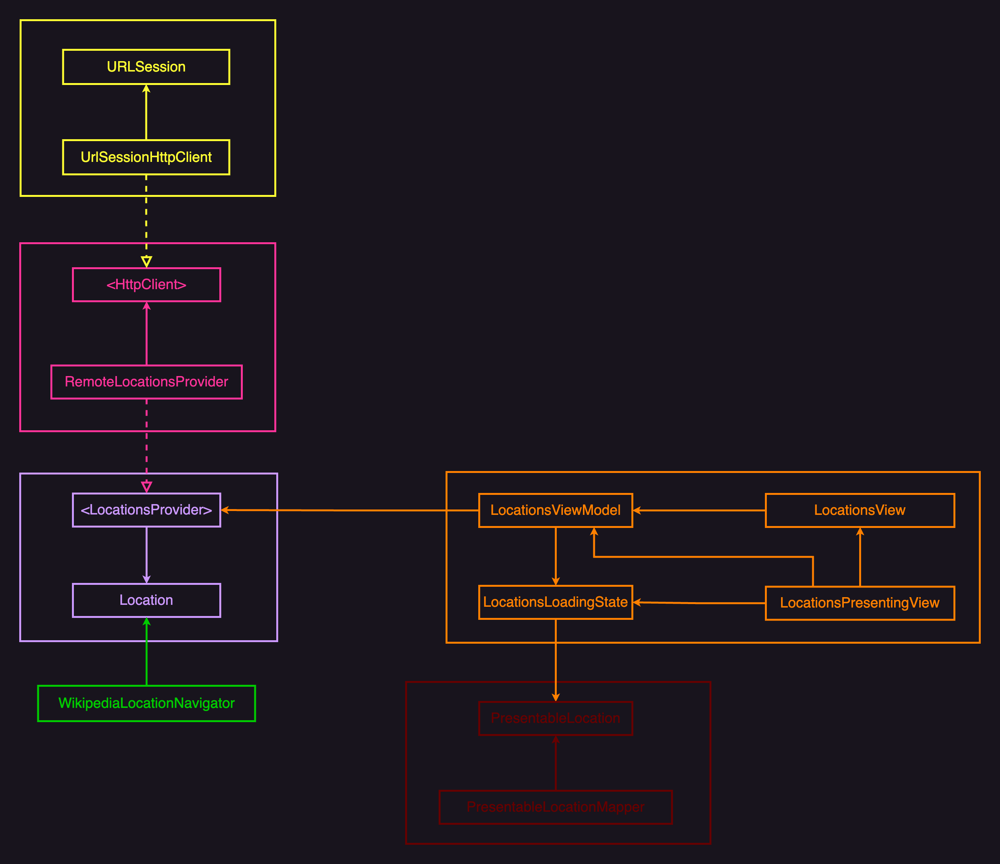

### Locations App 📍

In this repo you will find a simple iOS application which shows a list of locations from a remote JSON file. Whe location will be shown in the Wikipedia app once a location from the gets selected.

The Dependency Diagram shows the source code dependencies between the modules and components out of which this simple application is build. This should give you a clear picture of how the application is setup.

The `LocationProvider` abstraction acts as a polymorphic interface that allows use different sorts of implementations if we ever find the need to. We can create variants that load locations from disc, CoreData, from memory, you name it. We can even use this interface to leverage the power of some [Structural Design Patterns](https://refactoring.guru/design-patterns/structural-patterns) like Composite, Decorators to implement a caching mechanism, all without having to change any of the existing components. We only have to compose them differently in `LocationsApp.swift` [Composition Root](https://blog.ploeh.dk/2011/07/28/CompositionRoot/) which is where we instantiate and inject all our components into a working app. The same applies to the `HTTPClient` abstraction. It also helps us to keep `URLSession` from entering out codebase, which makes it easier to replace it with anything else if we ever see the need to move away from `URLSession`.

I split the view into two parts, first we have the `LocationsView` that is connected to the `LocationsViewModel` and the simple `LocationsPresentingView` that is does noting other that displaying the state. This makes it easy to create previews for each possible view state without the need to perform a bunch of actions on the `LocationsViewModel` to get it into the right state.

Another important thing to mention is the usage of `PresentableLocation` and the way I injected the mapping into the `LocationsViewModel`. This enabled me to bypass the `LocationsViewModel` when implement functionalities like opening Wikipedia on location selection. It prevents me from having to alter the `LocationsViewModel` every time we are called to extend the functionalities of the `Location UI`. Ideally, we should be able to create some new code and inject it into the composition.

As I was about to wrap up this assignment I noticed that I ended up with a bunch of small single purpose components which where all covered by Unit Tests. This is great but it didn’t gave me enough confidence that all these components in integration, delivers the expected behaviour. Because of this I decided to test them all in integration, so the `LocationsViewModelIntegrationTests` was born. The most important thing is that it tests agains the `LocationsViewModelAssembler` which is used in the production code. This way we can make sure that there no differences in setup between the test and production code. After I wrote the Integration tests I decided to remove the Unit Tests for the `LocationViewmodel` altogether because there was a bunch of duplcation and didn’t gave me more confidence.

A nice side effect of these Integration tests is that I can go nuts with refactoring, it is now easy to refactor the code with little to no chance of breaking the integration tests. See the  [**this**](https://github.com/Combidi/locations/commit/ddeb453bcefc74bab004ee6bd94e5a3c569805c2) commit where I injected the mapping logic into the `LocationViewModel` without any compiler errors in the integration tests.

Overal the setup is small and easy to understand. I used TDD to drive my implementation while staying true to the SOLID principles. I tailored the architecture to my needs and ended up with something that looks like MVVM. It suits the current requirements and welcomes future change.
